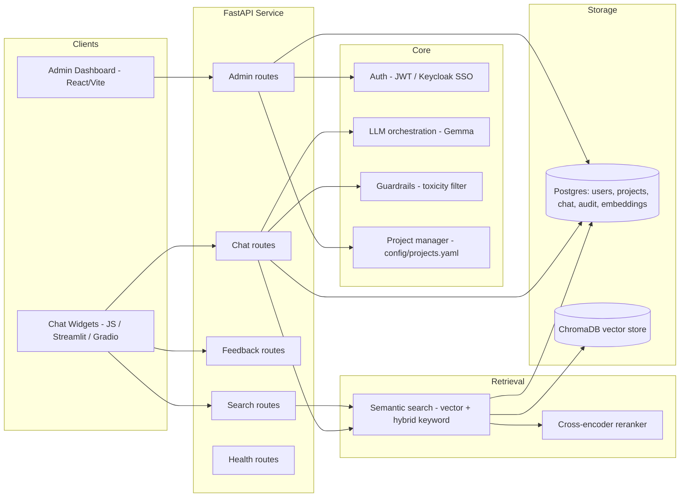

# Help Centre Chatbot Platform

A multi-project, audience-aware Retrieval-Augmented Generation (RAG) platform that powers chatbot and semantic search services for public health programs (TB, Cervical Cancer, Maternal Health, and future projects), together with a superadmin dashboard for managing users, projects, knowledge bases, and monitoring.

The platform is built as a modular FastAPI backend with a Postgres + pgvector/ChromaDB retrieval layer, a Gemma-based LLM for answer generation, and a React/Vite admin dashboard.

---

## Table of Contents

- [Overview](#overview)
- [Architecture](#architecture)
- [Features](#features)
- [Repository Structure](#repository-structure)
- [Database Schema](#database-schema)
- [Retrieval Pipeline](#retrieval-pipeline)
- [Configuration](#configuration)
- [Getting Started](#getting-started)
- [Deployment](#deployment)
- [Additional Documentation](#additional-documentation)

---

## Overview

Each supported program (e.g. TB, Cervical Cancer, Maternal Health) is registered as a **project**, and each project serves two **audiences**:

- **general** – patients and the public
- **clinicians** – healthcare workers

For every project/audience pair, the platform exposes a chat endpoint (grounded, LLM-generated answers), a semantic search endpoint (retrieval only), and a feedback endpoint. Answers are generated using retrieved evidence from a project- and audience-specific knowledge base, so responses stay grounded in vetted source material and remain traceable back to their source documents.

## Architecture



## Features

### Chatbot & Retrieval
- Project- and audience-scoped chat and search endpoints (e.g. `/tb/chat/general`, `/cervical_cancer/search/clinicians`).
- Retrieval-augmented generation: vector search (ChromaDB / pgvector) with optional hybrid keyword search (Reciprocal Rank Fusion) and cross-encoder reranking for higher-precision results.
- Query rewriting for follow-up questions, using recent conversation history to resolve pronouns and ambiguous references.
- Per-session, database-backed chat history that feeds multi-turn context into the LLM prompt.
- Configurable, per-project system prompts and response-style rules (`config/projects.yaml`).
- Source-attributed answers, so every response can be traced back to its originating document.

### Safety & Guardrails
- Toxicity screening on both user input and model output, with a safe fallback response when content is flagged.
- Per-project feature flags to enable/disable guardrails, reranking, hybrid retrieval, and chat history independently.

### Feedback
- 1–5 star ratings with optional free-text feedback, linked to the specific chat message being rated.

### Administration & Superadmin Dashboard
- JWT-based authentication, plus optional Keycloak SSO login.
- Role-based access control with two roles: **super_admin** (full platform control) and **project_admin** (scoped to assigned projects).
- User management: create, list, activate/deactivate, delete users, and assign/revoke roles.
- Project management: create/update/delete projects, manage enabled audiences, configure per-project feature flags, and assign project admins.
- Knowledge base management: upload/list/remove markdown sources, and trigger ingestion (chunk → embed → index) as background jobs.
- Monitoring: platform-wide and per-project usage overviews, audit logs, a toxicity/flagged-content feed, and exportable chat records (JSON/CSV).
- Startup bootstrap of a default super admin account when none exists.

### Resilience
- The API starts and continues serving chat/search traffic even if Postgres is unavailable; persistence (chat history, feedback, audit logs) degrades gracefully and the database status is reported clearly.

## Repository Structure

```
app/
  main.py               FastAPI app factory, middleware, startup hooks
  schemas.py             Pydantic request/response models
  api/routes/            chat, search, feedback, admin, health routers
  core/                  config, auth, keycloak, guardrails, LLM client,
                          prompts, chat history, project manager, KB admin
  retrieval/             semantic search (vector + hybrid) and reranker
  db/                    SQLAlchemy session/init, admin repo, persistence
config/
  projects.yaml          Per-project settings: audiences, collections,
                          LLM model/prompts, feature flags
knowledge_bases/          Source markdown + metadata CSVs per project/audience
data/                     Generated chunk JSON files
vector_db/                Generated ChromaDB persistence
interfaces/
  admin-dashboard/        React/Vite superadmin dashboard
  chat-ui/                Lightweight JS chat widget
  streamlit/, gradio/      Prototype chat UIs
scripts/                  Chunking, embedding/indexing, evaluation, and
                          operational utility scripts
deploy/                   Docker, docker-compose, and deployment scripts
docs/                     In-depth design, API reference, and architecture notes
tests/                    API and retrieval smoke tests
db_schema.sql             Postgres schema (pgvector + pgcrypto)
```

## Database Schema

The platform uses **PostgreSQL** with the `pgcrypto` and `pgvector` extensions (see [db_schema.sql](db_schema.sql)).

| Table | Purpose |
|---|---|
| `projects` | Registry of chatbot projects (id, name, domain, status, JSONB config for feature flags, prompts, etc.) |
| `project_audiences` | Enabled audiences (`general`, `clinicians`) per project |
| `users` | Login accounts (email, bcrypt password hash, active flag) |
| `roles` / `user_roles` | Global RBAC roles (`super_admin`, `project_admin`) assigned to users |
| `project_memberships` | Scopes a `project_admin` role to specific projects |
| `source_assets` | Metadata for ingested knowledge sources (name, URL, file, checksum, status, uploader) |
| `ingestion_jobs` | Background job tracking for knowledge-base ingestion (status, payload, errors, timestamps) |
| `index_runs` | Tracks each embedding/indexing run (model, chunk count, status) |
| `service_health_checks` | Component health snapshots per project |
| `audit_logs` | Actor, action, and entity trail for administrative operations |
| `chat_session` | One row per conversation (project, audience, client session id) |
| `chat_message` | Every user/AI turn: prompt sent to the LLM, model name, answer, retrieved sources, and input/output toxicity scores |
| `chat_feedback` | Star rating and optional text feedback tied to a specific `chat_message` |
| `knowledge_chunk_embedding` | Postgres-native chunk embeddings (`vector(1536)`) used for hybrid/keyword-assisted retrieval, with an `ivfflat` cosine index |

**Key relationships**

- `projects` is the anchor table — most other tables reference it via `project_id`.
- `chat_session → chat_message → chat_feedback` forms the conversation and feedback trail.
- `users → user_roles` (global roles) and `users → project_memberships` (project-scoped roles) form the authorization model.

## Retrieval Pipeline

1. **Chunking** (`scripts/chunk_markdown.py`) — splits markdown sources into overlapping chunks (`chunk_size=1000`, `chunk_overlap=100`) and attaches source metadata.
2. **Embedding & indexing** (`scripts/embed_and_index.py`) — embeds chunks and writes them into per-project, per-audience vector collections (ChromaDB and/or Postgres pgvector).
3. **Query time**:
   - The user query is rewritten if it looks like a follow-up (using recent chat history).
   - The query is embedded and matched against the relevant audience collection.
   - Optional hybrid keyword search is fused with vector results (Reciprocal Rank Fusion).
   - An optional cross-encoder reranker reorders the top candidates for relevance.
   - The best `k` results are returned as search results, or passed to the LLM as grounding context for chat.

## Configuration

Copy `.env.example` to `.env` and set values for your environment. Key configuration groups:

- **Database**: `DATABASE_URL`, `POSTGRES_USER`, `POSTGRES_PASSWORD`, `POSTGRES_DB`
- **LLM**: `GOOGLE_API_KEY`, `GEMMA_MODEL`
- **Embeddings**: `EMBEDDING_PROVIDER`, `EMBEDDING_MODEL`, `EMBEDDING_DIM`, `VECTOR_BACKEND`
- **Retrieval**: `RERANKER_ENABLED`, `RERANKER_MODEL`, `RERETRIEVAL_K`, hybrid retrieval flags
- **Auth**: `JWT_SECRET`, `JWT_ALGORITHM`, `JWT_EXPIRE_MINUTES`, Keycloak settings
- **Bootstrap**: `BOOTSTRAP_SUPER_ADMIN_EMAIL`, `BOOTSTRAP_SUPER_ADMIN_PASSWORD`
- **CORS**: `CORS_ALLOW_ORIGINS`

Per-project behavior (audiences, vector collection names, LLM system role, prompt rules, and feature flags) is defined in [config/projects.yaml](config/projects.yaml).

## Getting Started

### Prerequisites
- Python 3.10+
- PostgreSQL with the `pgvector` extension (optional — the API runs without it, with reduced persistence)

### Install dependencies

```bash
python3 -m pip install --upgrade pip
pip install -r requirements.txt
```

### Run the API

```bash
python3 -m uvicorn app.main:app --reload
```

### Build the knowledge base index

```bash
python3 scripts/chunk_markdown.py
python3 scripts/embed_and_index.py
```

### Run a front end

```bash
# Streamlit prototype
streamlit run interfaces/streamlit/app.py

# Gradio prototype
python3 interfaces/gradio/app.py

# Admin dashboard
cd interfaces/admin-dashboard && npm install && npm run dev
```

## Deployment

Deployment assets live under `deploy/`:

- `deploy/docker/Dockerfile` — application image
- `deploy/docker/docker-compose.yml` — Postgres + API service composition
- `deploy/scripts/entrypoint.sh` / `deploy/scripts/healthcheck.sh` — container startup and health checks

CI/CD is handled by `.github/workflows/deploy_to_vm.yml`, which installs dependencies, runs tests, builds the Docker image, and deploys the compose stack to the target VM.

## Additional Documentation

Deeper design and reference material lives under [docs/](docs/):

- [docs/api-reference.md](docs/api-reference.md) — full endpoint and RBAC reference
- [docs/system-architecture-analysis.md](docs/system-architecture-analysis.md) — architecture deep dive
- [docs/hybrid-retrieval-production.md](docs/hybrid-retrieval-production.md) — hybrid retrieval design notes
- [docs/implemented-requirements.md](docs/implemented-requirements.md) — feature-to-role capability matrix
