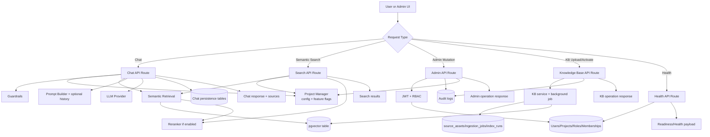
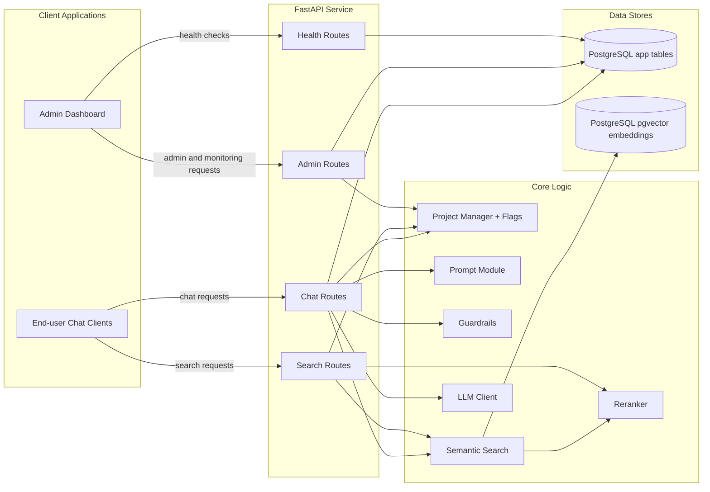
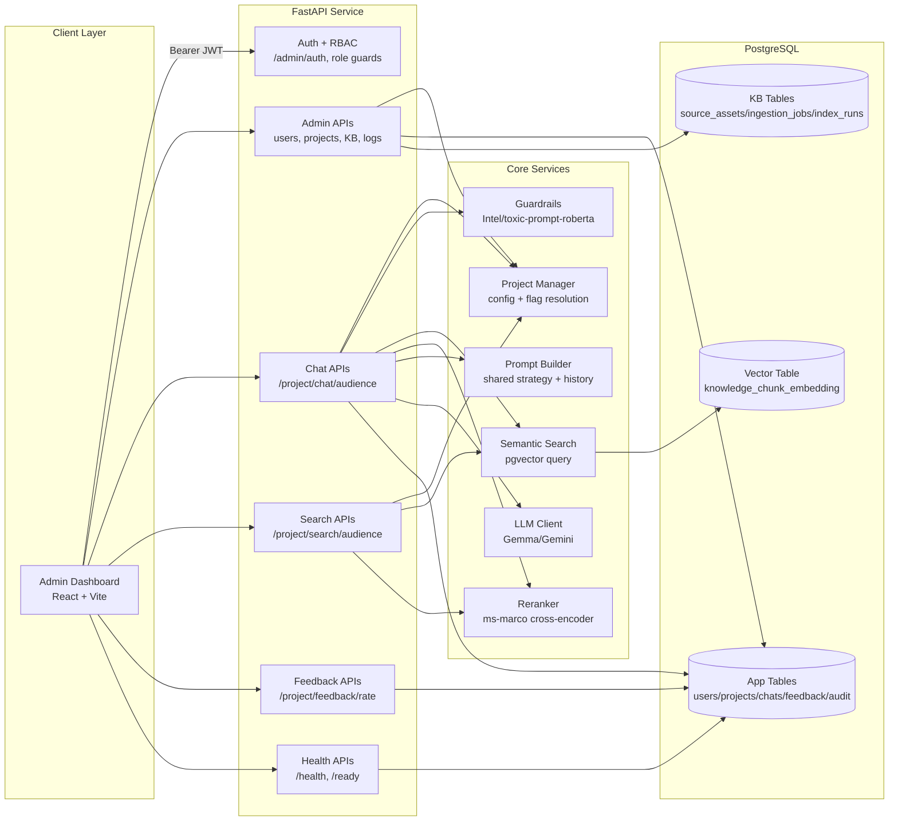
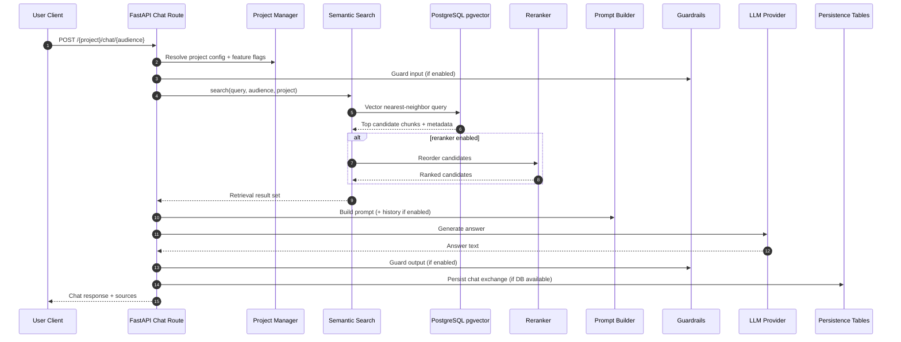
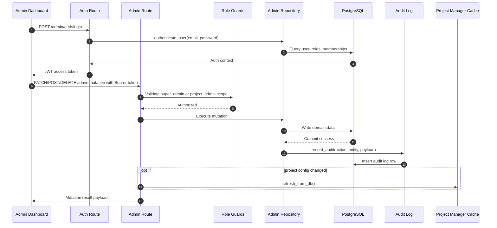
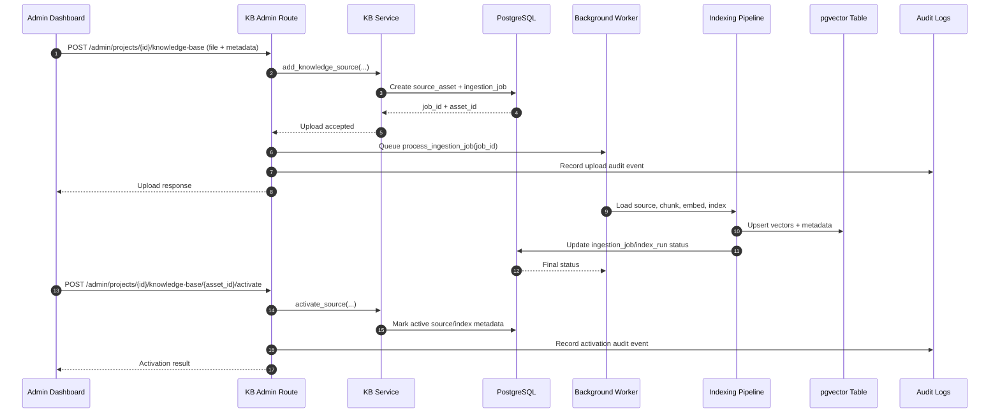

# System Architecture Analysis

## Scope
This document captures the current architecture of the Help Centre platform, including backend APIs, retrieval/LLM flow, persistence, admin operations, and frontend admin dashboard integration.

## Architectural Style
- API-first modular monolith (FastAPI app with route modules and core service modules).
- Shared PostgreSQL used for:
  - app persistence (users, projects, chat logs, feedback, audit, KB metadata)
  - vector similarity search via pgvector for chunk embeddings.
- Runtime behavior controlled by project-level and assistant-level feature flags.
- React + Vite admin dashboard consuming authenticated admin APIs.

## Main Components

### 1) Client Layer
- Admin dashboard: React app in interfaces/admin-dashboard.
- Auth uses JWT bearer token in localStorage.
- Core admin pages:
  - Project Center
  - Projects
  - Project Admins
  - User Management
  - Chat History
  - System Logs

### 2) API Layer (FastAPI)
- App entrypoint: app/main.py
- Routers:
  - app/api/routes/health.py
  - app/api/routes/chat.py
  - app/api/routes/search.py
  - app/api/routes/feedback.py
  - app/api/routes/admin.py
- Multi-project domain endpoints include tb, cervical_cancer, and maternal_health.

### 3) Core Services
- project_manager: project registry and feature flag resolution.
- prompts: shared prompt strategy + optional history incorporation.
- guardrails: toxicity classification gate for input/output.
- retrieval:
  - semantic_search: pgvector retrieval
  - reranker: optional cross-encoder reranking
- auth: JWT auth and role guards.

### 4) Data Layer
- SQLAlchemy models in app/db/models.py.
- Session management in app/db/session.py.
- Persistence helpers in app/db/persistence.py.
- Admin repository in app/db/admin_repo.py.
- Schema bootstrap in db_schema.sql.

### 5) Knowledge Ingestion Layer
- Source management endpoints under /admin/projects/{project_id}/knowledge-base.
- Jobs tracked via ingestion_jobs and index_runs tables.
- Knowledge assets tracked in source_assets.

## Runtime Feature Control
Feature flags are resolved in this order:
1. project-level llm.feature_flags (highest priority)
2. assistant-level feature_flags in config/projects.yaml
3. env overrides (GUARDRAILS_ENABLED, RERANKER_ENABLED, CHAT_HISTORY_ENABLED)
4. default value passed by caller

Controlled features:
- guardrails_enabled
- reranker_enabled
- chat_history_enabled

## Information Flow

### A) Chat Request Flow
1. Client calls /{project}/chat/{audience}.
2. API normalizes audience and validates input.
3. Query embedding is generated.
4. pgvector retrieval fetches top-k chunks from knowledge_chunk_embedding.
5. Optional reranker reorders candidates.
6. Prompt builder composes instructions + context (+ history when enabled).
7. LLM generates answer.
8. Optional toxicity checks run (input/output).
9. Chat exchange persisted (if DB available).
10. Response returned with answer and source metadata.

### B) Semantic Search Flow
1. Client calls /{project}/search/{audience}.
2. Query embedding generated.
3. pgvector nearest-neighbor query executed.
4. Optional reranker applied.
5. Search response returns documents + metadata + scores/distances.

### C) Admin Operations Flow
1. Admin user logs in via /admin/auth/login.
2. JWT token attached to subsequent admin requests.
3. Role checks enforce super_admin or project_admin access.
4. Mutations write domain tables and audit logs.
5. Project config mutations refresh in-memory project cache.

### D) Knowledge Base Management Flow
1. File upload request creates a source asset + ingestion job record.
2. Background job processes source and index operations.
3. Activation endpoint promotes selected asset/version for retrieval.
4. Deletion endpoint removes source association and records audit event.

## End-to-End Flowchart

## Information Exchange Diagram

## System Diagram

## Full Structure Breakdown

### Repository-Level Structure
- app
  - api/routes: route controllers for health, chat, search, feedback, and admin operations.
  - core: auth, prompts, guardrails, config, project manager, llm utilities.
  - retrieval: semantic retrieval and reranking logic.
  - db: models, persistence logic, admin repository, session lifecycle.
- interfaces/admin-dashboard
  - src/pages: operational UI by admin capability.
  - src/lib/api.ts: API client base URL and docs URL wiring.
  - src/context: auth context and token lifecycle.
- config/projects.yaml
  - assistant-level prompt policy and global feature defaults.
  - project-level collections, audiences, model options, and feature flags.
- deploy
  - environment and deployment templates.
  - runtime behavior flags for guardrails/reranker/chat history.

### Data Structure (High-Level)
- Identity and access: users, roles, user_roles, project_memberships.
- Project management: projects, project_audiences.
- Retrieval assets: source_assets, ingestion_jobs, index_runs, knowledge_chunk_embedding.
- Conversation telemetry: chat_session, chat_message, chat_feedback.
- Audit and operations: audit_logs, service_health_checks.

## Flow Sequence Diagrams

### 1) Chat Request Sequence

### 2) Admin Mutation Sequence

### 3) Knowledge Base Ingestion Sequence

## Operational Characteristics
- Startup:
  - DB initialization attempted first.
  - Admin defaults bootstrap executed when DB is ready.
  - Embedding client, reranker, and guardrails initialized.
- Degraded behavior:
  - If DB is unavailable at startup, API still serves non-persistent paths.
  - Readiness endpoint reports DB status/reason.
- Security:
  - JWT-based auth.
  - Super admin and project admin role guards on admin routes.

## Known Risks and Hardening Opportunities
- A query bug in one endpoint can affect DB availability handling if exceptions are interpreted as connection failures.
- Bundle size warning in admin frontend indicates optimization opportunity (route-level code splitting).
- Feature toggle governance can be improved with explicit audit trail views per flag change (partially implemented).

## Recommended Next Documentation
- API contract snapshot by route group and expected payload schema.
- Data model ERD with cardinality for admin/KB/chat tables.
- Deployment runbook with startup order and rollback steps.
